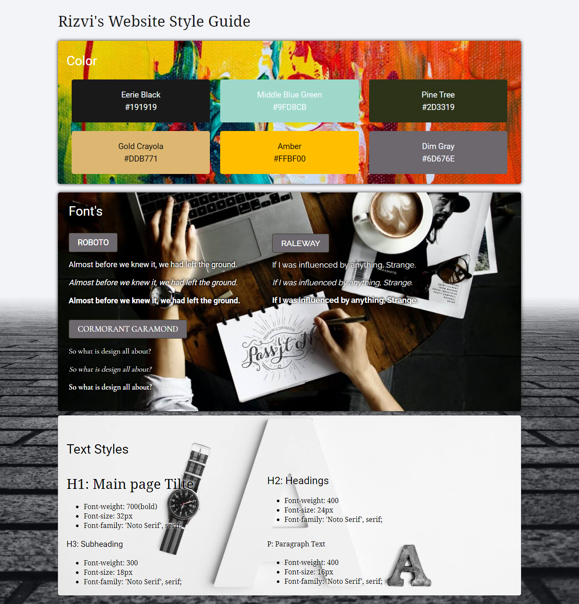

# Website Design System
> Used My knowledge of HMTL5 And CSS3

## Table of contents
* [General info](#general-info)
* [Screenshots](#screenshots)
* [Technologies](#technologies)
* [Status](#status)

## General info
A static web page. Made this cause I want to test my skill.

## Screenshots
## Desktop

## Mobo

## Technologies
* HTML5
* CSS3

## Features
This page will work for every device

## Status
Project is finished
